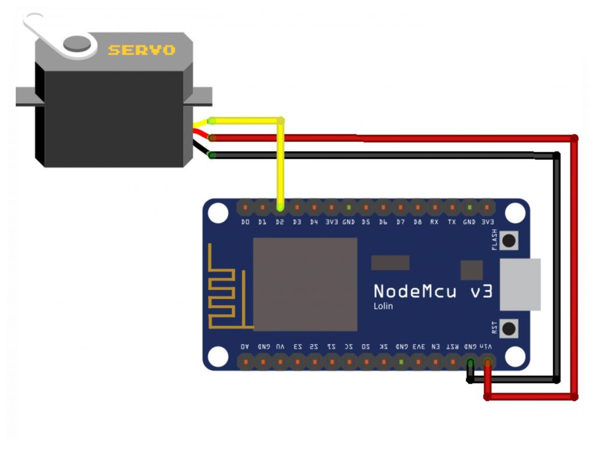

# BLYNK IoT Servo Control

## Description:

- A servo motor is a DC motor equipped with a control circuit with a closed feedback system integrated into the motor. In a servo motor, the rotation position of the axis of the motor will be informed back to the control circuit in the servo motor. If this servo motor is connected to an IoT device, the movement of the servo motor can be controlled from anywhere.

## Circuit Schematic

- 

## Component (Tools & Materials):

- NodeMCU ESP8266 = 1 unit;
- Servo Motor (SG-90) = 1 unit;
- Wired.

## Sketch Program:

```cpp
#define BLYNK_PRINT Serial
#include &lt;ESP8266WiFi.h&gt;
#include &lt;BlynkSimpleEsp8266.h&gt;
#include &lt;Servo.h&gt;

char auth[] = "XXXX";
char ssid[] = "Veendy-Suseno";
char pass[] = "Admin12345";

Servo servo;
BLYNK_WRITE(V3){
servo.write(param.asInt());
}

void setup(){
    Serial.begin(9600);
    Blynk.begin(auth, ssid, pass);
    servo.attach(9);
}

void loop(){
    Blynk.run();
}

```

## BLYNK Settings:

- Use the Slider type Widget Box: <br/>
  <br/>
- Widget Box Slider selection image. <br/>

- In Slider Settings, select the Virtual V3 pin, then set the maximum value to 90. <br/>
  <br/>
- Slider settings image. <br/>

## Interface:

<br/>

- BLYNK Servo Control interface image. <br/>

## Conclusion:

- In this project, NodeMCU is connected to the Blynk application wirelessly used to control the movement of the servo motor. In the Blynk application there is a slider used to determine the angle of the servo motor rotation.
